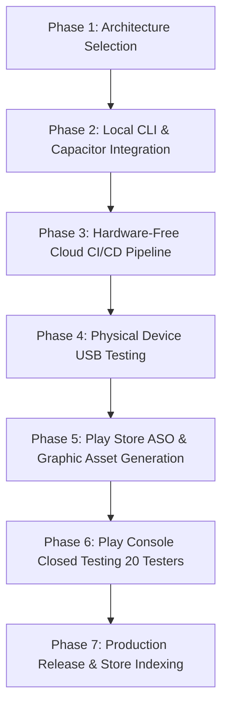

# Modern Snake Game — Android Migration & Google Play Store Master Plan

Welcome to the comprehensive Android Migration and Google Play Store Optimization (ASO/SEO) master documentation for **Modern Snake Game**.

This documentation suite is tailored specifically for **low-spec development environments** (avoiding heavy local Android Studio emulators and memory-intensive IDE processes) while maintaining **top-tier 60FPS performance, native Android capabilities, and maximum Google Play Store search discoverability**.

---

## 📑 Documentation Index

| File | Description | Target Audience |
| :--- | :--- | :--- |
| [**`01_MIGRATION_STRATEGY_AND_TECH_STACK.md`**](./01_MIGRATION_STRATEGY_AND_TECH_STACK.md) | Architectural comparison of Capacitor vs. TWA (Bubblewrap) vs. Flutter. Decision matrix for low-spec PCs. | Architects & Developers |
| [**`02_LOW_SPEC_PC_SETUP_AND_CLOUD_BUILD.md`**](./02_LOW_SPEC_PC_SETUP_AND_CLOUD_BUILD.md) | Lightweight CLI dev setup, USB physical device debugging (zero emulator lag), and 100% Cloud CI/CD via GitHub Actions. | Developers |
| [**`03_CAPACITOR_TWA_STEP_BY_STEP_GUIDE.md`**](./03_CAPACITOR_TWA_STEP_BY_STEP_GUIDE.md) | Step-by-step implementation guide: Capacitor initialization, native plugins (Haptics, Status Bar, Splash Screen, In-App Review), and manifest tweaking. | Implementers |
| [**`04_FLUTTER_REWRITE_ARCHITECTURE.md`**](./04_FLUTTER_REWRITE_ARCHITECTURE.md) | Complete Dart / Flame engine architecture blueprint for a pure Flutter rewrite (Game loop, canvas renderer, procedural synth translation, state management). | Flutter Engineers |
| [**`05_PLAY_STORE_ASO_AND_SEO_GUIDE.md`**](./05_PLAY_STORE_ASO_AND_SEO_GUIDE.md) | High-conversion Play Store keyword strategy, App Title, Short Description, Long Description with optimized keyword density, and Category selection. | Growth & Marketers |
| [**`06_GRAPHICS_ASSETS_AND_METADATA_SPECS.md`**](./06_GRAPHICS_ASSETS_AND_METADATA_SPECS.md) | Production asset guidelines: 512x512 App Icon, Adaptive Icon layers, 1024x500 Feature Graphic, screenshot templates, and promo video scripts. | Designers & Developers |
| [**`07_PLAY_CONSOLE_RELEASE_CHECKLIST.md`**](./07_PLAY_CONSOLE_RELEASE_CHECKLIST.md) | Release runbook: Key generation (Keystore), Google Play Console setup, 20-tester closed testing roadmap, Data Safety questionnaire, and launch sequence. | Release Managers |

---

## ⚡ Fast-Track Summary for Low-Spec PC

If your development machine has limited RAM (e.g. 4GB - 8GB RAM, integrated graphics, or older CPU):

1. **Avoid Android Studio IDE & Emulators**: Running the Android Emulator + Gradle daemon requires 12GB+ RAM to remain responsive.
2. **Recommended Stack — Capacitor + Cloud GitHub Actions**:
   - Wrap the existing high-performance vanilla JS canvas engine directly via **Capacitor 6 / Android TWA**.
   - Test locally by connecting an Android phone via USB and running `adb` or Chrome Remote Inspect (`chrome://inspect`).
   - Build unsigned/signed `.aab` (Android App Bundle) and `.apk` binaries 100% in the cloud using **GitHub Actions runners** (free 2,000 monthly build minutes).
3. **Zero JavaScript Re-write**: The current 97KB `game.js`, Web Audio procedural synthesizer, and CSS styling remain 100% reusable with 60FPS hardware-accelerated WebView rendering.

---

## 🚀 Execution Roadmap

Explore each document in this directory for detailed technical guides, copy templates, and configuration scripts.
